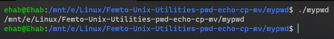
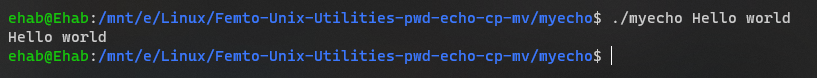
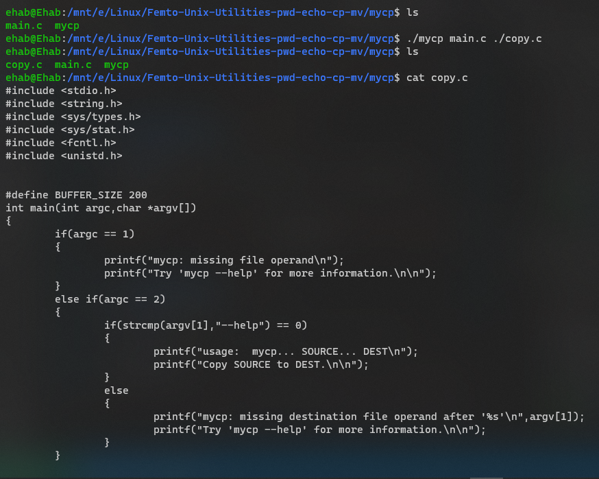
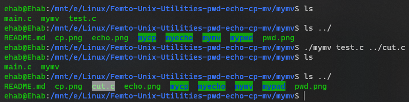

<h1 align="center">Femto-Unix-Utilities-pwd-echo-cp-mv</h1>

---
## 📝 Table of Contents

- [1. pwd command](#pwd_command)
- [2. echo command](#echo_command)
- [3. cp command](#cp_command)
- [4. mv command](#cmv_command)

---
## 1.pwd command 
- ### ⛏️ compilation command
    >$ gcc -o mypwd main.c
- ### 🎈 Usage
    This command print the current working directory.

    >$ ./mypwd
- ### 💻 output
    >

---
## 2.echo command 
- ### ⛏️ compilation command 
    >$ gcc -o myecho main.c
- ### 🎈 Usage
    This command print the input of the user back to the terminal.

    >$ ./myecho Hello world 
- ### 💻 output
    >

---
## 3.cp command 
- ### ⛏️ compilation command 
    >$ gcc -o mycp main.c
- ### 🎈 Usage
    This command copy source file to destination file.

    >$ ./mycp main.c copy.c 
- ### 💻 output
    >

---
## 3.mv command 
- ### ⛏️ compilation command 
    >$ gcc -o mymv main.c
- ### 🎈 Usage
    This command move source file to destination directory or Rename source to destination.

    >$ ./mycp main.c copy.c 
- ### 💻 output
    >

